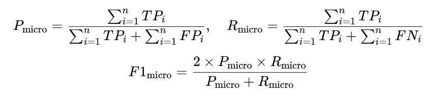
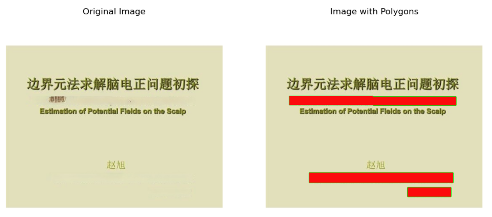
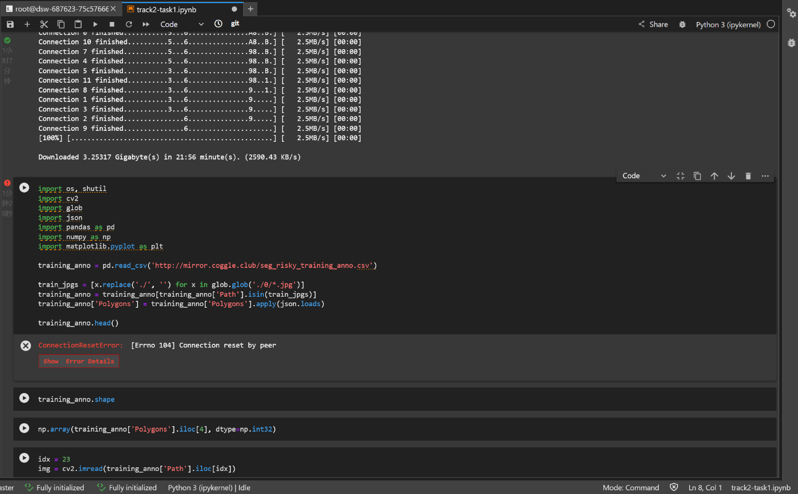
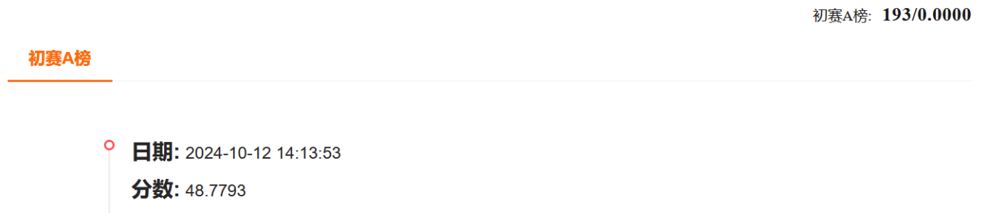

# AI Authentication for Credential Tampering Detection in Financial Scenarios

# 1.Competition Introduction

**Global AI Offense and Defense Challenge**

Under the general trend of global artificial intelligence development and governance, sponsored by the China Image Graphics Society, Ant Group, and Cloud Security Alliance CSA Greater China, a wide range of academic circles and institutions jointly organized a global AI offensive and defense challenge. This competition includes two categories of attack and defense, focusing on the security of the large model itself and the anti-counterfeiting detection of the content generated by the large model, involving multiple business scenarios such as credit growth, credential audit, merchant settlement, intelligent assistant, and covering multiple algorithm fields such as machine learning, image processing and computer vision, and data processing. It aims to bring together industry and academic forces to jointly safeguard the safety of AI and large models, and jointly promote the development of secure and trusted AI technologies.
https://tianchi.aliyun.com/competition/entrance/532267/introduction


## Competition Background

Amid the global trend of growing concern regarding the development and governance of artificial intelligence, the Chinese Society of Image and Graphics, Ant Group, and CSA Greater China are jointly launching the Global AI Offense and Defense Challenge in collaboration with academic and industry partners. This competition features two main tracks—one focusing on the security of large models themselves, and the other on detecting forgeries in content generated by large models. These tracks involve multiple business scenarios, including credit building, document verification, merchant onboarding, and intelligent assistants. They also span multiple algorithmic fields such as machine learning, image processing, computer vision, and data processing. The objective is to unite the power of both industry and academia to safeguard AI and large models, and to promote the development of secure and trustworthy AI technology.

> Challenge 2: AI-Based Identity Verification—Tampering Detection for Financial Documents

Interactive self-verification scenarios in the financial sector encompass various applications such as credit building, user account opening, merchant onboarding, professional certification, and merchant account limit removals. Typically, users must submit certain documentation (i.e., credentials) to prove asset or income information, identity information, ownership information, transaction information, and qualification information. The authenticity of these credentials has long been a challenge for automated reviews in financial scenarios. With the advancement of digital media editing technology, an increasing number of AI methods and tools can easily alter these documents. Criminal groups have also mastered tools like Photoshop and AIGC (AI-generated content) to produce highly realistic, tampered samples, posing significant challenges for financial reviews.

To address this, we have established the AI-Based Identity Verification—Financial Document Tampering Detection track. A large-scale dataset of tampered credentials will be released, enabling participants to develop models using this extensive tampered dataset. Corresponding test sets will be provided to evaluate the effectiveness of these models.

## Task Description

In the financial sector, interactive self-verification scenarios—such as user account opening, merchant onboarding, professional certification, and merchant account limit removals—often require users to submit certain documentation to prove identity, ownership, transaction, and qualification. The authenticity of these credentials has long posed a challenge for automated verification. As digital media editing technology continues to evolve, more AI tools can seamlessly alter credential data. Meanwhile, criminal enterprises are also mastering tools like Photoshop and AIGC to produce highly convincing fake credentials, further complicating financial audits.

Hence, the AI-Based Identity Verification—Financial Document Tampering Detection track is introduced. A large-scale dataset of tampered credentials will be released, and participants will develop their models using this dataset. A corresponding test set will also be provided to assess model performance.

## Competition Task

Participants are required to design algorithms capable of identifying tampered regions within credential images.

## Dataset Introduction

**Important Note: Participants are not allowed to use any additional data.**

This competition will release a massive, internally developed “Optics Identification” credential dataset, which integrates a significant amount of open-source image data along with proprietary business data. Tampering methods—such as copy-move, splicing, removal, and partial AIGC—are performed on text regions in the original images to produce digitally edited content.

Model generalization will be a key criterion in this competition. Therefore, the test set will include a broader range of credential types and tampering techniques than the training set.

The dataset is structured as follows:

- The training set contains 1 million images, each accompanied by annotations indicating the tampered regions. The annotations are provided in a CSV file with two columns. For example:

| Path                                   | Polygon                                            |
| -------------------------------------- | -------------------------------------------------- |
| 9/9082eccbddd7077bc8288bdd7773d464.jpg | [[[143, 359], [432, 359], [437, 423], [141, 427]]] |

- The test set is split into Leaderboard A and Leaderboard B, each containing 100,000 test images. The test set follows the same format as the training set but does not include annotation files.

## Evaluation Metric

Micro-F1 is used as the evaluation metric. A higher Micro-F1 indicates a higher ranking. Each submission file should include an `id` and its corresponding `region`, upon which the scoring rules are based. First, we will verify that the `id` in the submitted results matches the label set—please ensure there are no omissions or extraneous IDs. Next, for each `id`, we will compare the submitted `region` field with the ground truth and calculate the overlap. Combining these overlaps with a threshold, we determine the values of TP (True Positive), TN (True Negative), FP (False Positive), and FN (False Negative).

We then compute the participant’s Precision (P) and Recall (R). Precision measures the proportion of correctly predicted positives among all predicted positives, while Recall measures the proportion of actual positives that are correctly predicted. Finally, we calculate the Micro-F1 score by considering all categories comprehensively, using the following formulas:



# 2.Environment

### 2.1 Magic Notebook[2]

**Interactive modeling PAI-DSW**
PAI-DSW is a cloud-based deep learning development environment for algorithm developers.

```
Built-in JupyterLab, WebIDE and Terminal,
Write, debug, and run Python code without any operational configuration.
8 cores 32GB video memory 24GB
Pre-installed ModelScope Library
Pre-installed ubuntu22.04-cuda12.1.0-py310-torch2.3.0-1.18.0
```

### 2.2 ModelScope Library[4]

ModelScope Library is an open source AI model library platform launched by Alibaba DAMO Academy, which aims to provide developers with a platform to integrate multiple AI models. 

It allows users to access and work with a variety of pre-trained models, covering many areas such as computer vision, natural language processing, speech processing, and more.

# 3.Dataset

The total amount of training set data is 100w

Provide the tampered certificate image and the corresponding tampered position mark

The annotation files are given in csv format

The csv file contains two columns

The following is an example of the content:

| Path                                   | Polygon                                            |
| -------------------------------------- | -------------------------------------------------- |
| 9/9082eccbddd7077bc8288bdd7773d464.jpg | [[[143, 359], [432, 359], [437, 423], [141, 427]]] |




## **3.1Data Augmentation**

#### 1.**Augmentation Techniques**

- **Flip**: Horizontal and vertical flipping.
- **Rotation**: Random rotation of the image.
- **Scaling**: Resizing images while maintaining proportions.
- **Color Adjustment**: Modifying brightness, contrast, and saturation.

#### **2 Libraries**

- **Albumentations**: A powerful augmentation library for deep learning.
- **Imgaug**: Flexible library for image transformations.
- **TensorFlow’s ImageDataGenerator**: Built-in augmentation tool in TensorFlow.

#### **3 Parameters**

| **Parameter**    | **Description**                           |
| ---------------- | ----------------------------------------- |
| **hsv_h**        | Hue adjustment                            |
| **hsv_s**        | Saturation adjustment                     |
| **hsv_v**        | Brightness adjustment                     |
| **degrees**      | Random rotation                           |
| **translate**    | Image translation                         |
| **scale**        | Scaling                                   |
| **shear**        | Shearing transformation                   |
| **perspective**  | Perspective transformation                |
| **flipud**       | Vertical flip                             |
| **fliplr**       | Horizontal flip                           |
| **bgr**          | Convert RGB to BGR                        |
| **mosaic**       | Combine four images                       |
| **mixup**        | Blend two images and labels               |
| **copy_paste**   | Copy objects and paste onto another image |
| **auto_augment** | Custom augmentation strategies            |
| **erasing**      | Randomly erase parts of an image          |

# 4.YOLO Model Training Parameters

During the initial training phase, the learning rate starts low and gradually increases for a stable process. However, since the model has already learned some features from previous datasets, starting with a higher learning rate might be more beneficial. Most YOLO parameters can use default values.

## **YOLO Training Parameters**

| **Parameter**       | **Description**                                              |
| ------------------- | ------------------------------------------------------------ |
| **imgsz**           | Target image size for training; all images are resized accordingly. |
| **save_period**     | Frequency of saving model checkpoints; -1 disables saving.   |
| **device**          | Computing device for training (single/multiple GPUs, CPU, or MPS for Apple Silicon). |
| **optimizer**       | Optimizer used during training (SGD, Adam, or 'auto' for automatic selection). |
| **momentum**        | Momentum factor for SGD or beta1 for Adam.                   |
| **weight_decay**    | L2 regularization term to prevent overfitting.               |
| **warmup_epochs**   | Number of epochs for learning rate warm-up.                  |
| **warmup_momentum** | Initial momentum during the warm-up phase.                   |
| **warmup_bias_lr**  | Learning rate for bias parameters during warm-up.            |
| **box**             | Weight of the bounding box loss in the loss function.        |
| **cls**             | Weight of the classification loss in the total loss function. |
| **dfl**             | Weight of the distribution focal loss.                       |

# 5. Configuring YOLO Model Prediction Behavior and Performance

The YOLO model provides detailed prediction outputs, including object detection information such as class probability, confidence, and bounding box coordinates. It can handle various data sources, including single images, image collections, video files, and real-time video streams, while supporting batch processing to improve inference speed.

#### **Prediction Attributes**

| **Attribute**  | **Description**                                              |
| -------------- | ------------------------------------------------------------ |
| **cls**        | Class probability indicating the likelihood of the detected object belonging to class 0. |
| **conf**       | Confidence score representing the model’s certainty in its prediction. |
| **data**       | Raw data containing bounding box coordinates, confidence scores, and class probabilities. |
| **id**         | No unique object ID assigned.                                |
| **is_track**   | Indicates that the prediction is not from object tracking.   |
| **orig_shape** | Original input image size (e.g., 500x500 pixels).            |
| **shape**      | Tensor shape of the prediction, representing six values per bounding box. |
| **xywh**       | Normalized bounding box coordinates: center coordinates and width/height. |
| **xywhn**      | Normalized bounding box coordinates without offset.          |
| **xyxy**       | Original bounding box coordinates (top-left and bottom-right corners). |
| **xyxyn**      | Normalized original bounding box coordinates.                |

### **Optimization Parameters**

| **Parameter** | **Default Value** | **Description**                                              |
| ------------- | ----------------- | ------------------------------------------------------------ |
| **conf**      | 0.25              | Confidence threshold: detections below this threshold are ignored to reduce false positives. |
| **iou**       | 0.7               | Intersection over Union (IoU) threshold for Non-Maximum Suppression (NMS); lower values reduce duplicate detections. |
| **imgsz**     | 640 (default)     | Defines the image size during inference; can be a single integer or a tuple (height, width). Proper sizing balances accuracy and speed. |
| **augment**   | False             | Enables Test-Time Augmentation (TTA), which improves robustness but may slow down inference. |

### **Performance Adjustments**

- **To reduce false positives** → Increase `conf` threshold.
- **To speed up inference** → Use **half-precision** (on supported hardware).
- **For faster video processing** → Adjust `vid_stride` to skip frames.

# 6.Problem

## 6.1 Data set is too large, LINUX download failed

Download files using PowerShell:

Windows comes with PowerShell, which can be downloaded using the Invoke-WebRequest command. Open PowerShell and run the following command:

```powershell
Invoke-WebRequest -Uri "http://mirror.coggle.club/seg_risky_testing_data.zip" -OutFile "seg_risky_testing_data.zip"
```

This downloads the data set to the current directory. Or download it in separate lines

## 6.2 ConnectionResetError:[Errno 184]Connection reset by peer



Download failure

http://mirror.coggle.club/seg_risky_training_anno.csv

```python
# training_anno = pd.read_csv('http://mirror.coggle.club/seg_risky_training_anno.csv')
training_anno = pd.read_csv('./seg_risky_training_anno.csv')
```

## 6.3 The DataLoader thread crashes due to low memory or resource allocation issues

1. The memory is insufficient

The main cause of the crash is that the DataLoader thread is forcibly terminated by the system, which is usually due to insufficient system memory or GPU memory, especially when using large amounts of data (such as large batch size).
Solution:

Reduce the batch size: Try to reduce the batch parameter, for example from 128 to 32 or 16. Larger batches can cause crashes due to excessive video memory usage.

Reduce the number of DataLoader worker threads: The num_workers parameter controls the number of CPU threads used in DataLoader. The default value is high (e.g. 8), but you can reduce it to 2 or 4 to reduce the memory footprint.

2. Adjust CUDA configurations

Reduce GPU footprint: If you are running low on GPU memory, in addition to reducing batch size, you can also use half=True to enable mixed precision training and reduce video footprint:

3. Solution

```python
from ultralytics import YOLO

model = YOLO("./yolov11n-seg.pt")  
results = model.train(data="./yolo_seg_dataset/data.yaml", epochs=30, imgsz=640,batch=8,workers=4,half=True)
```

## 6.4 polygon problem

In the YOLO yolo11n-seg.pt model used, the coordinates of the **polygon** are returned, not just the four corner coordinates of a rectangular box.

The reason is that this is a segmentation model, not just a model for object detection.

In the code, the model results returns an object that contains masks,

result.masks.xy returns the contour coordinates of each detected object mask.

These coordinates usually represent the vertices of the object's outline and are therefore a polygon, not necessarily a simple rectangle.

So there might be more than four coordinates, which is normal.

But the competition requirements must be four points, pass multiple points up of course zero points

So **Use OpenCV to process the polygon coordinates and get the four vertices of the smallest external rectangle**

# 7.Result




## Reference

[1] 赛事链接：全球AI攻防挑战赛—赛道二：AI核身之金融场景凭证篡改检测
https://tianchi.aliyun.com/competition/entrance/532267/introduction

[2] 魔搭Notebook
https://www.modelscope.cn/my/mynotebook/preset

[3] Window11安装ubuntu22.05-cuda12.1.0
https://blog.csdn.net/aiqq136/article/details/142856947

