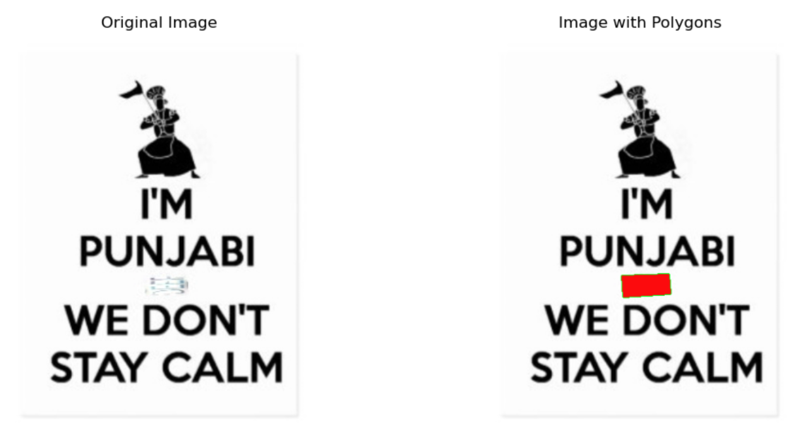
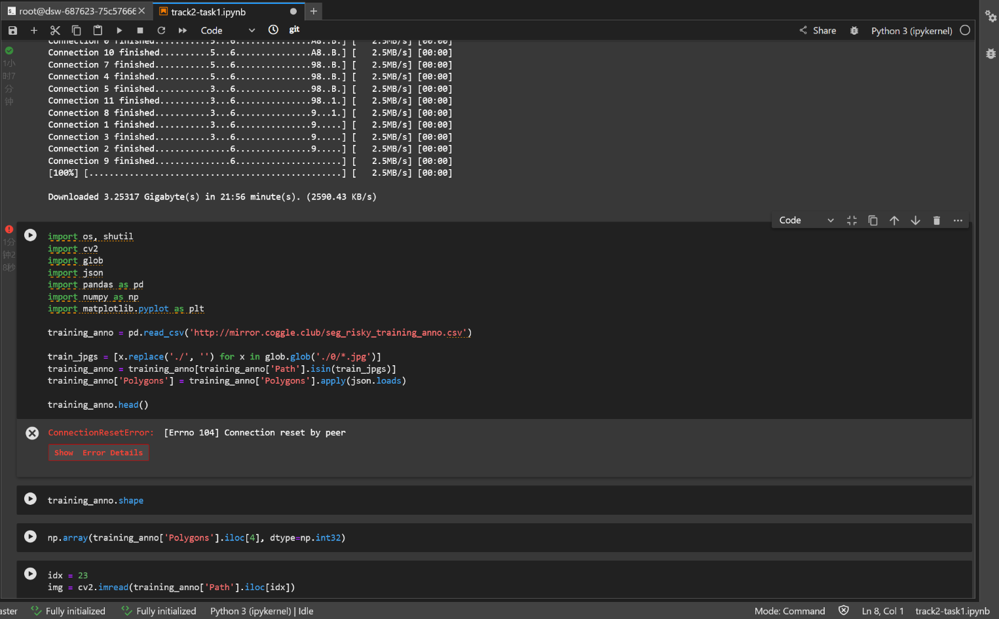
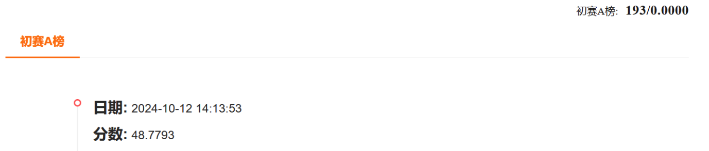

# AI核身之金融场景凭证篡改检测

# 1.比赛介绍

全球AI攻防挑战赛

在全球人工智能发展和治理广受关注的大趋势下，由中国图象图形学学会、蚂蚁集团、云安全联盟CSA大中华区主办，广泛联合学界、机构共同组织发起全球AI攻防挑战赛。本次比赛包含攻防两大赛道，分别聚焦大模型自身安全和大模型生成内容的防伪检测，涉及信用成长、凭证审核、商家入驻、智能助理等多个业务场景，覆盖机器学习、图像处理与计算机视觉、数据处理等多个算法领域，旨在聚合行业及学界力量共同守护AI及大模型的安全，共同推动AI安全可信技术的发展。
https://tianchi.aliyun.com/competition/entrance/532267/introduction


## 大赛背景

在全球人工智能发展和治理广受关注的大趋势下，由中国图象图形学学会、蚂蚁集团、云安全联盟CSA大中华区主办，广泛联合学界、机构共同组织发起全球AI攻防挑战赛。本次比赛包含攻防两大赛道，分别聚焦大模型自身安全和大模型生成内容的防伪检测，涉及信用成长、凭证审核、商家入驻、智能助理等多个业务场景，覆盖机器学习、图像处理与计算机视觉、数据处理等多个算法领域，旨在聚合行业及学界力量共同守护AI及大模型的安全，共同推动AI安全可信技术的发展。

> 赛题二：AI核身-金融场景凭证篡改检测

金融领域交互式自证业务中涵盖信用成长、用户开户、商家入驻、职业认证、商户解限等多种应用场景，通常都需要用户提交一定的材料（即凭证）用于证明资产收入信息、身份信息、所有权信息、交易信息、资质信息等，而凭证的真实性一直是困扰金融场景自动化审核的一大难题。随着数字媒体编辑技术的发展，越来越多的AI手段和工具能够轻易对凭证材料进行篡改，大量的黑产团伙也逐渐掌握PS、AIGC等工具制作逼真的凭证样本，并对金融审核带来巨大挑战。
为此，开设AI核身-金融凭证篡改检测赛道。将会发布大规模的凭证篡改数据集，参赛队伍在给定的大规模篡改数据集上进行模型研发，同时给出对应的测试集用于评估算法模型的有效性。

## 任务说明

金融领域交互式自证业务中涵盖用户开户、商家入驻、职业认证、商户解限等多种应用场景，通常都需要用户提交一定的材料（即凭证）用于证明身份信息、所有权信息、交易信息、资质信息等，而凭证的真实性一直是困扰金融场景自动化审核的一大难题。随着数字媒体编辑技术的发展，越来越多的AI手段和工具能够轻易对凭证材料进行篡改，大量的黑产团伙也逐渐掌握PS、AIGC等工具制作逼真的凭证样本，并对金融审核带来巨大挑战。
为此，开设AI核身-金融凭证篡改检测赛道。将会发布大规模的凭证篡改数据集，参赛队伍在给定的大规模篡改数据集上进行模型研发，同时给出对应的测试集用于评估算法模型的有效性。

## 比赛任务

在本任务中，要求参赛者设计算法，找出凭证图像中的被篡改的区域。

## 数据集介绍

**特别说明：参赛选手不允许使用额外数据**

本次比赛将发布超大规模自研光鉴凭证数据集，该数据集整合了大量开源的图像数据和内部的业务数据。数据的构建方式为在原始图像数据上针对文字区域采用copy move，splicing，removal，局部AIGC等方式进行数字篡改编辑。
模型的泛化性也将是此次比赛重要的衡量指标，因此本次的测试集将比训练集包含更多的凭证类型和篡改编辑手法。

数据集格式如下：

- 训练集数据总量为100w，提供篡改后的凭证图像及其对应的篡改位置标注，标注文件以csv格式给出，csv文件中包括两列，内容示例如下：

| Path                                   | Polygon                                            |
| -------------------------------------- | -------------------------------------------------- |
| 9/9082eccbddd7077bc8288bdd7773d464.jpg | [[[143, 359], [432, 359], [437, 423], [141, 427]]] |

- 测试集分为A榜和B榜，分别包含10w测试数据。测试集中数据格式与训练集中一致，但不包含标注文件。

## 评价指标

采用Micro-F1作为评价指标，该分数越高表示排名越靠前。每个选手提交的文件中都包含了id和对应的region，我们的评分规则是基于这两个字段进行计算的。首先，我们会判断选手提交结果中的id是否和标签一致，请避免出现遗漏或者溢出，其次，会将选手的提交结果中每个id的region字段与真实标签进行比对和重叠度计算，再结合阈值统计出选手的TP（True Positive）、TN（True Negative）、FP（False Positive）和FN（False Negative）。

接着，我们会计算出选手的准确率P（Precision）和召回率R（Recall）。准确率是指选手正确预测出正例的比例，召回率是指选手正确预测出所有正例的能力。最后，我们将综合考虑各个类别的表现并打分，打分评价指标使用微平均Micro-F1。计算公式如下：


# 2.环境

### 2.1 Magic Notebook[2]

**Interactive modeling PAI-DSW**
PAI-DSW is a cloud-based deep learning development environment for algorithm developers.

```
Built-in JupyterLab, WebIDE and Terminal,
Write, debug, and run Python code without any operational configuration.
8 cores 32GB video memory 24GB
Pre-installed ModelScope Library
Pre-installed ubuntu22.04-cuda12.1.0-py310-torch2.3.0-1.18.0
```

### 2.2 ModelScope Library[4]

ModelScope Library is an open source AI model library platform launched by Alibaba DAMO Academy, which aims to provide developers with a platform to integrate multiple AI models. 

It allows users to access and work with a variety of pre-trained models, covering many areas such as computer vision, natural language processing, speech processing, and more.

# 3.Dataset

The total amount of training set data is 100w

Provide the tampered certificate image and the corresponding tampered position mark

The annotation files are given in csv format

The csv file contains two columns

The following is an example of the content:

| Path                                   | Polygon                                            |
| -------------------------------------- | -------------------------------------------------- |
| 9/9082eccbddd7077bc8288bdd7773d464.jpg | [[[143, 359], [432, 359], [437, 423], [141, 427]]] |




## **3.1Data Augmentation**

#### 1.**Augmentation Techniques**

- **Flip**: Horizontal and vertical flipping.
- **Rotation**: Random rotation of the image.
- **Scaling**: Resizing images while maintaining proportions.
- **Color Adjustment**: Modifying brightness, contrast, and saturation.

#### **2 Libraries**

- **Albumentations**: A powerful augmentation library for deep learning.
- **Imgaug**: Flexible library for image transformations.
- **TensorFlow’s ImageDataGenerator**: Built-in augmentation tool in TensorFlow.

#### **3 Parameters**

| **Parameter**    | **Description**                           |
| ---------------- | ----------------------------------------- |
| **hsv_h**        | Hue adjustment                            |
| **hsv_s**        | Saturation adjustment                     |
| **hsv_v**        | Brightness adjustment                     |
| **degrees**      | Random rotation                           |
| **translate**    | Image translation                         |
| **scale**        | Scaling                                   |
| **shear**        | Shearing transformation                   |
| **perspective**  | Perspective transformation                |
| **flipud**       | Vertical flip                             |
| **fliplr**       | Horizontal flip                           |
| **bgr**          | Convert RGB to BGR                        |
| **mosaic**       | Combine four images                       |
| **mixup**        | Blend two images and labels               |
| **copy_paste**   | Copy objects and paste onto another image |
| **auto_augment** | Custom augmentation strategies            |
| **erasing**      | Randomly erase parts of an image          |

# 4.YOLO Model Training Parameters

During the initial training phase, the learning rate starts low and gradually increases for a stable process. However, since the model has already learned some features from previous datasets, starting with a higher learning rate might be more beneficial. Most YOLO parameters can use default values.

## **YOLO Training Parameters**

| **Parameter**       | **Description**                                              |
| ------------------- | ------------------------------------------------------------ |
| **imgsz**           | Target image size for training; all images are resized accordingly. |
| **save_period**     | Frequency of saving model checkpoints; -1 disables saving.   |
| **device**          | Computing device for training (single/multiple GPUs, CPU, or MPS for Apple Silicon). |
| **optimizer**       | Optimizer used during training (SGD, Adam, or 'auto' for automatic selection). |
| **momentum**        | Momentum factor for SGD or beta1 for Adam.                   |
| **weight_decay**    | L2 regularization term to prevent overfitting.               |
| **warmup_epochs**   | Number of epochs for learning rate warm-up.                  |
| **warmup_momentum** | Initial momentum during the warm-up phase.                   |
| **warmup_bias_lr**  | Learning rate for bias parameters during warm-up.            |
| **box**             | Weight of the bounding box loss in the loss function.        |
| **cls**             | Weight of the classification loss in the total loss function. |
| **dfl**             | Weight of the distribution focal loss.                       |

# 5. Configuring YOLO Model Prediction Behavior and Performance

The YOLO model provides detailed prediction outputs, including object detection information such as class probability, confidence, and bounding box coordinates. It can handle various data sources, including single images, image collections, video files, and real-time video streams, while supporting batch processing to improve inference speed.

#### **Prediction Attributes**

| **Attribute**  | **Description**                                              |
| -------------- | ------------------------------------------------------------ |
| **cls**        | Class probability indicating the likelihood of the detected object belonging to class 0. |
| **conf**       | Confidence score representing the model’s certainty in its prediction. |
| **data**       | Raw data containing bounding box coordinates, confidence scores, and class probabilities. |
| **id**         | No unique object ID assigned.                                |
| **is_track**   | Indicates that the prediction is not from object tracking.   |
| **orig_shape** | Original input image size (e.g., 500x500 pixels).            |
| **shape**      | Tensor shape of the prediction, representing six values per bounding box. |
| **xywh**       | Normalized bounding box coordinates: center coordinates and width/height. |
| **xywhn**      | Normalized bounding box coordinates without offset.          |
| **xyxy**       | Original bounding box coordinates (top-left and bottom-right corners). |
| **xyxyn**      | Normalized original bounding box coordinates.                |

### **Optimization Parameters**

| **Parameter** | **Default Value** | **Description**                                              |
| ------------- | ----------------- | ------------------------------------------------------------ |
| **conf**      | 0.25              | Confidence threshold: detections below this threshold are ignored to reduce false positives. |
| **iou**       | 0.7               | Intersection over Union (IoU) threshold for Non-Maximum Suppression (NMS); lower values reduce duplicate detections. |
| **imgsz**     | 640 (default)     | Defines the image size during inference; can be a single integer or a tuple (height, width). Proper sizing balances accuracy and speed. |
| **augment**   | False             | Enables Test-Time Augmentation (TTA), which improves robustness but may slow down inference. |

### **Performance Adjustments**

- **To reduce false positives** → Increase `conf` threshold.
- **To speed up inference** → Use **half-precision** (on supported hardware).
- **For faster video processing** → Adjust `vid_stride` to skip frames.

# 6.Problem

## 6.1 Data set is too large, LINUX download failed

Download files using PowerShell:

Windows comes with PowerShell, which can be downloaded using the Invoke-WebRequest command. Open PowerShell and run the following command:

```powershell
Invoke-WebRequest -Uri "http://mirror.coggle.club/seg_risky_testing_data.zip" -OutFile "seg_risky_testing_data.zip"
```

This downloads the data set to the current directory. Or download it in separate lines

## 6.2 ConnectionResetError:[Errno 184]Connection reset by peer



Download failure

http://mirror.coggle.club/seg_risky_training_anno.csv

```python
# training_anno = pd.read_csv('http://mirror.coggle.club/seg_risky_training_anno.csv')
training_anno = pd.read_csv('./seg_risky_training_anno.csv')
```

## 6.3 The DataLoader thread crashes due to low memory or resource allocation issues

1. The memory is insufficient

The main cause of the crash is that the DataLoader thread is forcibly terminated by the system, which is usually due to insufficient system memory or GPU memory, especially when using large amounts of data (such as large batch size).
Solution:

Reduce the batch size: Try to reduce the batch parameter, for example from 128 to 32 or 16. Larger batches can cause crashes due to excessive video memory usage.

Reduce the number of DataLoader worker threads: The num_workers parameter controls the number of CPU threads used in DataLoader. The default value is high (e.g. 8), but you can reduce it to 2 or 4 to reduce the memory footprint.

2. Adjust CUDA configurations

Reduce GPU footprint: If you are running low on GPU memory, in addition to reducing batch size, you can also use half=True to enable mixed precision training and reduce video footprint:

3. Solution

```python
from ultralytics import YOLO

model = YOLO("./yolov11n-seg.pt")  
results = model.train(data="./yolo_seg_dataset/data.yaml", epochs=30, imgsz=640,batch=8,workers=4,half=True)
```

## 6.4 polygon problem

In the YOLO yolo11n-seg.pt model used, the coordinates of the **polygon** are returned, not just the four corner coordinates of a rectangular box.

The reason is that this is a segmentation model, not just a model for object detection.

In the code, the model results returns an object that contains masks,

result.masks.xy returns the contour coordinates of each detected object mask.

These coordinates usually represent the vertices of the object's outline and are therefore a polygon, not necessarily a simple rectangle.

So there might be more than four coordinates, which is normal.

But the competition requirements must be four points, pass multiple points up of course zero points

So **Use OpenCV to process the polygon coordinates and get the four vertices of the smallest external rectangle**

# 7.Result




## Reference

[1] 赛事链接：全球AI攻防挑战赛—赛道二：AI核身之金融场景凭证篡改检测
https://tianchi.aliyun.com/competition/entrance/532267/introduction

[2] 魔搭Notebook
https://www.modelscope.cn/my/mynotebook/preset

[3] Window11安装ubuntu22.05-cuda12.1.0
https://blog.csdn.net/aiqq136/article/details/142856947

